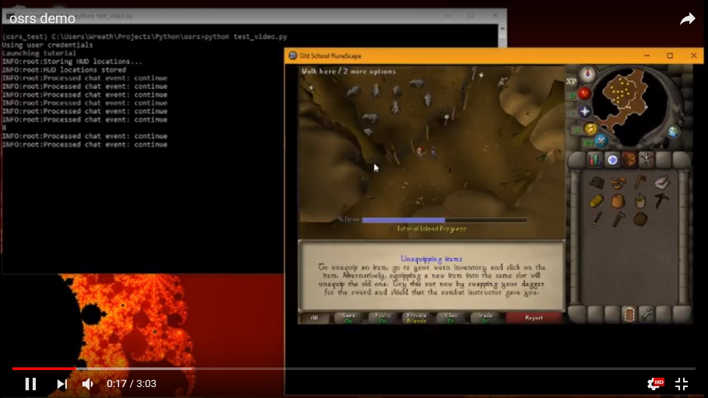

# osrs

## Botting programs for Old School Runescape

1. woodcutter.py

Automatically cut and drop normal trees, oaks, and willows; bank some log types

2. tutorial.py

Complete Tutorial Island

3. makeAccount.py

Register new accounts on the RuneScape website and store the account credentials

4. startAccount.py

On a brand new account, use woodcutting profits to acquire a list of starting supplies from the Grand Exchange
